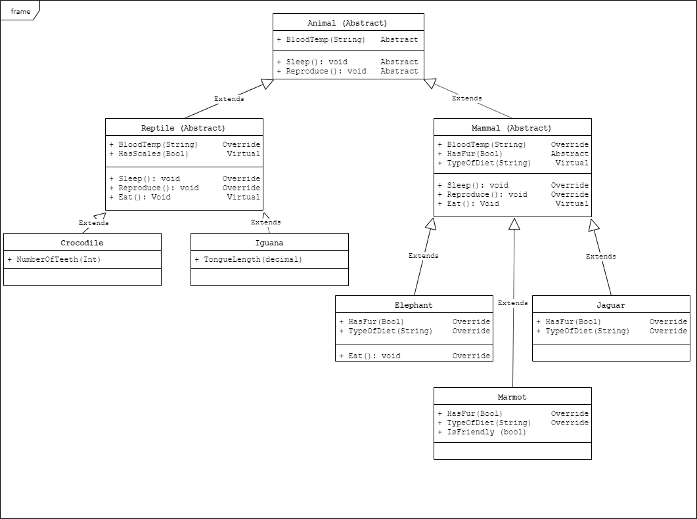
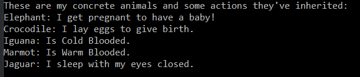

# Console Classes of a Zoo

Lab05-OOP-Principles

*Author: Chris Cummings*

----

## Description
As of 1.0, this solution only builds out 3 levels of classes of different animals.
The animals are divided into mammals and reptiles, and further divided into individual classes.

---

### Getting Started
Clone this repository to your local machine.

```
$ git clone https://github.com/cdcummings10/Lab05--Zoo.git
```

### To run the program from Visual Studio:
Select ```File``` -> ```Open``` -> ```Project/Solution```

Next navigate to the location you cloned the Repository.

Double click on the ```Lab05_Zoo``` directory.

Then select and open ```Zoo.sln```

Click on ```Start```

### To run the executable:

Navigate to folder ```Lab05_Zoo``` directory.

Navigate through these folders: ```Zoo``` => ```Zoo``` => ```bin``` => ```Debug```

Run ```Zoo.exe```

---

### Object Oriented Programming Principles
##### Abstraction
Abstraction is the taking of real world concepts and translating the properties of them that we need
into computer data.

Example in code: All of my animal classes are examples of abstraction.

##### Encapsulation
Encapsulation is putting things into containers and hiding information to keep data and variables untouched
by processes that shouldn't have access to them.

Example in code: All my properties are examples of creating a hidden variable that other programs can't touch
unless it uses the get or set functions.

##### Inheritance
Inheritance is the ability of a class to inherit the methods of a base class. The base class' methods are
called from the derivative class.

Example in code: My concrete classes all inherit methods and properties from their parent and base classes.

##### Polymorphism
Polymorphism is the ability to remember the base class. The class will behave the as it was defines, but it
will still remember the other classes.

Example in code: Calling an array of animals in a test, but they all behave as they were initiated.

#### Interfaces
An interface is a class-like type that we can use to link like classes together to perform a very
specific action.

My two interfaces that were implemented at IGetFedMeat and ILick. I implemented these because there 
are multiple classes that can do both in reptile and mammal, but not all do these things. For
example: crocodiles and jaguars are reptiles and mammals respectively, but they both eat meat. 
it wouldn't make sense to add it to any of the abstract classes.

---

### Visuals

#### UML Chart


#### App Start



---

### Time Estimates
Estimated time to finish: 4.5 Hours

Actual time to finish: 6 Hours

### Change Log 

1.0: *Finished Building out of Animal Classes.* - 21 Oct 2019

1.1: *Added Interfaces to Animal Classes. Added new tests for Interfaces.* - 22 Oct 2019
